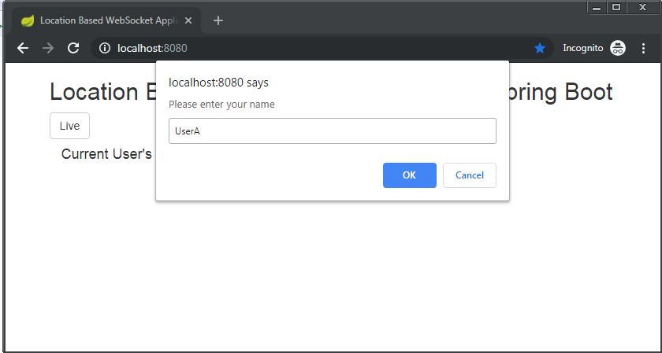
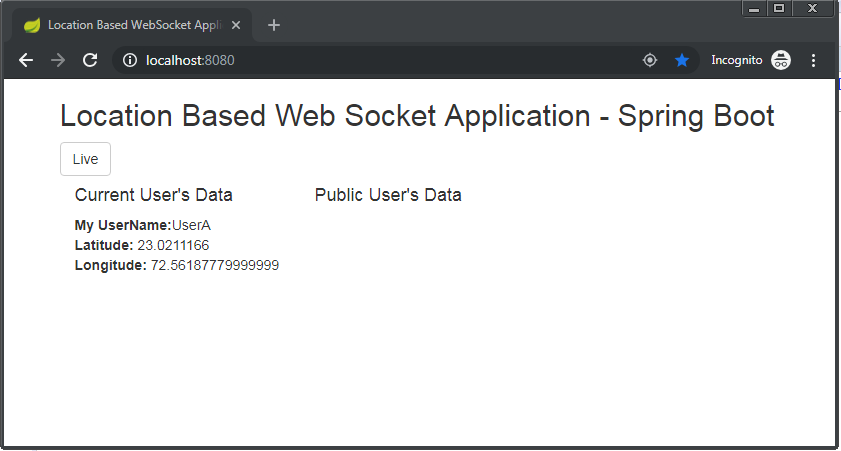
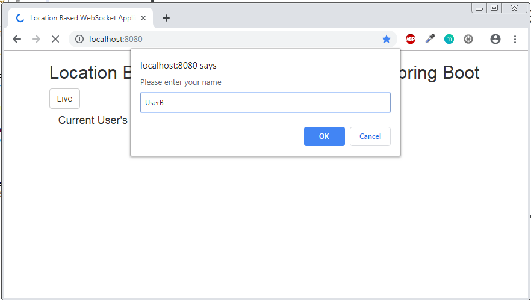
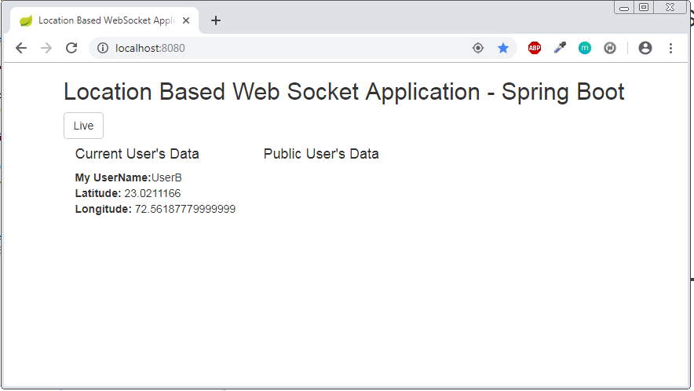
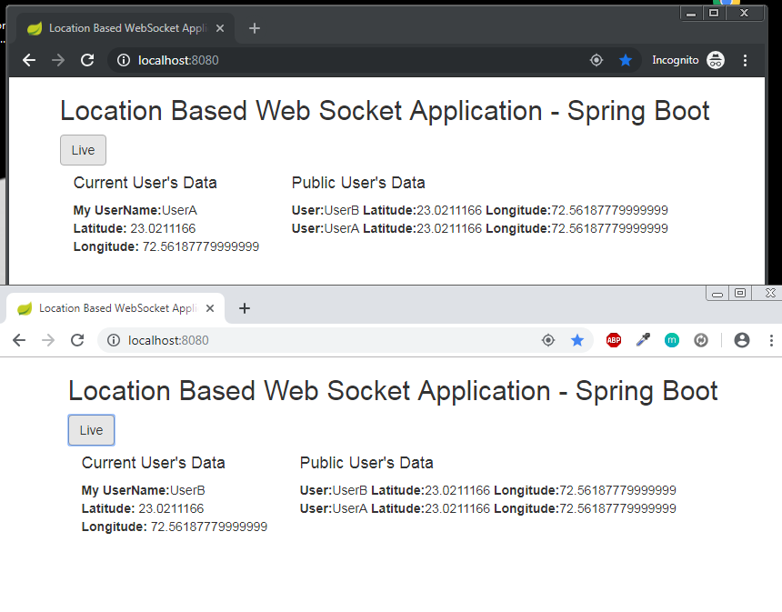
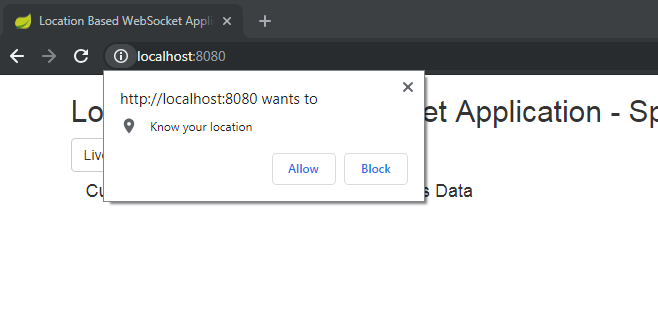
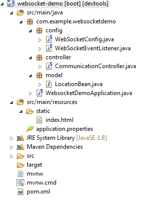

# Spring Boot - Location based web socket application
### spring-boot-websocket

> In this appliction you will know how to create Location based web socket application with Spring Boot in simplest way.

### Let’s Setup Environment

1. Maven 3 or any latest version
2. JDK 1.8 / JDK 1.9 or any latest version
3. Eclipse Kepler / Eclipse Juno / Eclipse Neon or any latest version

### Extract that project and import in eclipse.

> File > Import > Existing Maven Projects > Click ``Next`` > Select project root directory > Click ``Finish``

# Project Description

## Definition: 
-	Create Web Socket Endpoint that is receiving location from users.
-	Web socket broadcast all user's location to all connected users.
-	Display Map on page.
-	User can select his location and press Live Button.
-	Upon clicking on live button, his location will be shared every 10 seconds to the server via WEB SOCKET.
-	Display all other user's location in the Map.

## Solution: 

### Technology used: 
Server Side = 	Spring Boot for web application
                Spring Web Socket for managing socket communication from server side

Client Side = 	Html5 Geolocation from browser for getting user’s live actual location from web page
		            SockJS for web socket communication from web page
		            Bootstrap for web page design
		            Jquery for web page interaction

> In this project I haven’t used any database for storing the data. I have stored data in memory.

Bellow I have described screenshot of the application,

### 1)	Firstly, when user enter in the application then, He/She have to provide username.

### 2)	If user has entered username as UserA. Then, web page shows that user’s current location. In that time no other user is online so, public user’s data is blank.

### 3)	In that time if other username called UserB is enters.

### 4)	UserB is show his/her current location on page

### 5)	After clicking on Live button on page in both the user’s screen, All connected user’s latest location is getting feed from server via web socket and current user continuously sending their location to web server from web page.

### 6)	At starting point, User have to allow access of location from browser to get their location

### 7)	Project structure of the project

# That's It...you are ready to Run

> Right click to project > Run As > Spring Boot App

go to http://localhost:8080/

## Meta

Rutvik Patel - rrpatel003@gmail.com

Distributed under the GPL V3.0 license. See ``LICENSE`` for more information.
